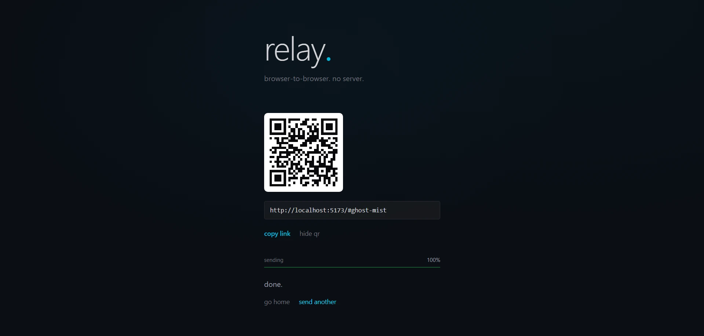

# relay

peer-to-peer file transfer. browser to browser. no server.

## usage

1. open relay in your browser
2. select files or drop them in
3. share the link with someone
4. files transfer directly between you

## how it works

- webrtc datachannels for p2p transfer
- signaling server coordinates connections
- works across networks, NAT traversal via STUN

## limits

- 2 peers only (sender + receiver)
- connection dies when either closes the tab

## run locally

```bash
# signaling server
cd signaling-server
pnpm install
pnpm dev

# client
cd client
pnpm install
pnpm dev
```

server runs on `ws://localhost:3000`, client on `http://localhost:5173`

## preview

<p align="center">
  
  
</p>
